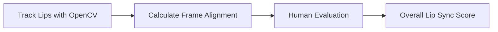
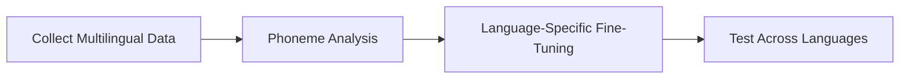
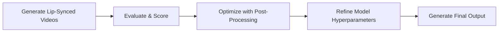

# 👄 Lip-Syncing Pipeline – MVP Phase

This section documents the lip-syncing pipeline activities under the MVP phase.  
We use **Wav2Lip** as our base model and enhance it for multilingual, emotion-aware, and accurate synchronization between AI-generated speech and video frames.

---

## 🎯 Objectives

- Train and test the Wav2Lip model.
- Build evaluation metrics for lip-sync accuracy.
- Adapt lip-syncing for different languages and accents.
- Optimize outputs to look natural and emotionally accurate.

---

## 🛠️ 1. Train & Test Wav2Lip

### Overview

Use Wav2Lip to match AI-generated speech with lip movements in video frames.

### Activities

1. **Collect diverse video samples** (with different speakers, languages, accents, and emotions).
2. **Extract audio and video** using tools like `ffmpeg`.
3. **Preprocess and align** the audio with video frames.
4. **Train Wav2Lip** using default weights or fine-tune on your data.
5. **Test and generate outputs** for validation.

## 📏 2. Develop Evaluation Metrics

### 🎯 Objective

Create measurable ways to assess how well lips sync with speech.

---

### 🛠️ Activities

#### ✅ Objective Tests

- Use **DeepFaceLab** or **OpenCV** to track mouth movement.
- Calculate **frame alignment** and **mouth openness vs. phoneme timeline**.

#### ✅ Subjective Tests

- Use **Mean Opinion Scores (MOS)** from human reviewers on a 1–5 scale for:
  - Realism  
  - Sync quality  
  - Naturalness

## 🌐 3. Handle Languages & Accents

### 🎯 Objective

Ensure that lip-syncing works accurately across different languages, dialects, and phonetic structures.

---

### 🛠️ Activities

- Collect a **multilingual dataset** (e.g., English, Spanish, Hindi).
- Understand **language-specific phoneme structures** and their variations.
- Fine-tune the **Wav2Lip** model for each language or dialect.
- Adjust synchronization timing to align with **different speech cadences** and syllable timings.
- Validate output videos through:
  - **Visual review** by human evaluators.
  - **Feedback sessions** with multilingual speakers.

---

## 🚀 4. Testing & Optimization

### 🎯 Objective

Improve the overall performance and visual realism of the lip-synced outputs by refining model predictions, testing against real data, and optimizing post-processing workflows.

---
## 🚀 4. Testing & Optimization

### 🎯 Objective

Improve the overall performance and visual realism of the lip-synced outputs by refining model predictions, testing against real data, and optimizing post-processing workflows.

---

### 🛠️ Activities

- **Generate lip-synced videos** using the trained Wav2Lip model on test samples.
- **Compare** the outputs with real human speech videos to assess:
  - Mouth movement accuracy
  - Facial emotion consistency
  - Visual quality
- **Post-process videos** using tools like `ffmpeg` for:
  - Frame stabilization
  - Frame rate matching
  - Audio sync smoothing
- **Tune hyperparameters** such as:
  - Learning rate
  - Epochs
  - Batch size
  - Audio-video alignment thresholds
- **Retrain and test iteratively** with improved, augmented, or diversified datasets.

---

