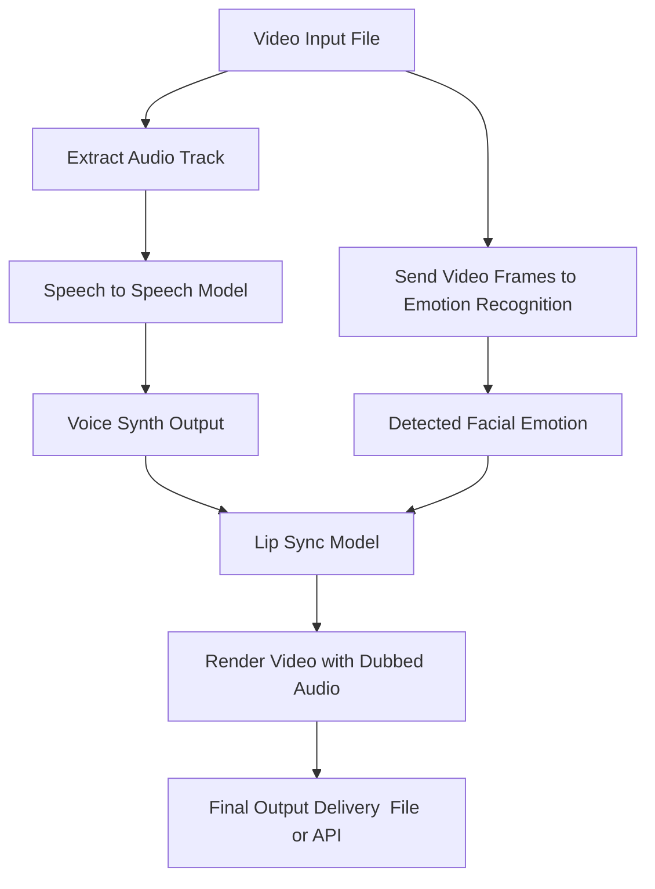
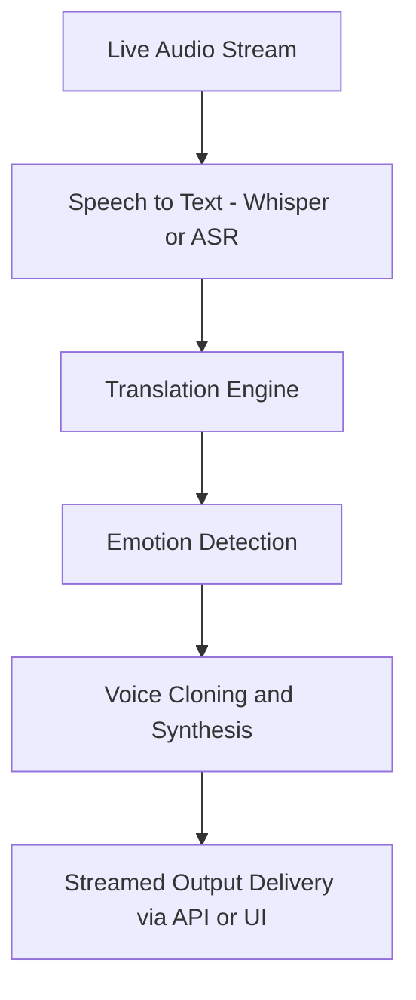

# Project Overview

Welcome to the VocaSync Project Documentation!  
This project is designed to deliver hyper-personalized AI dubbing experiences using cutting-edge speech-to-speech, emotion recognition, and language localization models.

---

## 🎥 Video Input Flow

!!! info "Video Input Processing Flow"

    This flow represents the full processing pipeline when the input is a video file. The system extracts both audio and  visual signals, processes them independently, and combines them using a lip-sync model to produce a fully dubbed and emotionally aligned video.

## 🔊 Livestream Audio Processing Flow

The video input is processed in parallel: the audio is routed through a speech-to-speech model to generate a dubbed voice, while the visual frames are analyzed for emotional context. These two outputs are merged in the lip-sync model, producing a synchronized and emotionally accurate final video.
!!! info "Livestream Audio Processing Flow"
     This pipeline outlines the real-time dubbing process for live audio streams, such as live sports, podcasts, or events. The input is passed through several stages to generate an emotionally resonant and language-localized dubbed stream.

The live audio stream is first transcribed, translated into the target language, and passed through emotion detection before being synthesized into a human-like voice and streamed in real time. This ensures both linguistic accuracy and emotional fidelity.

---